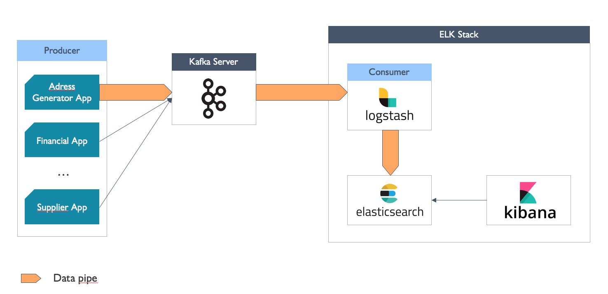
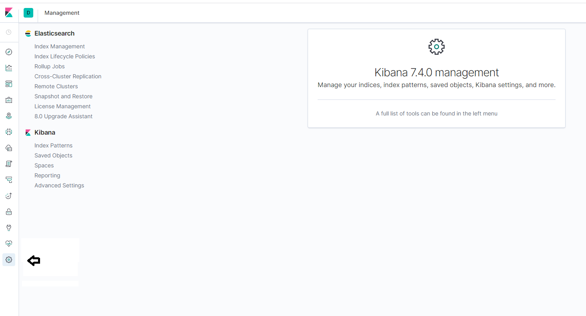
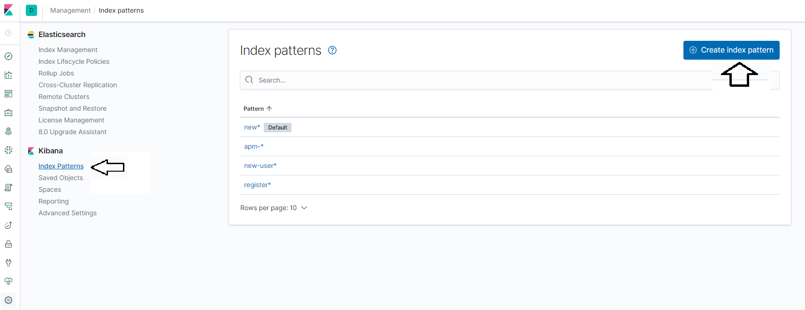
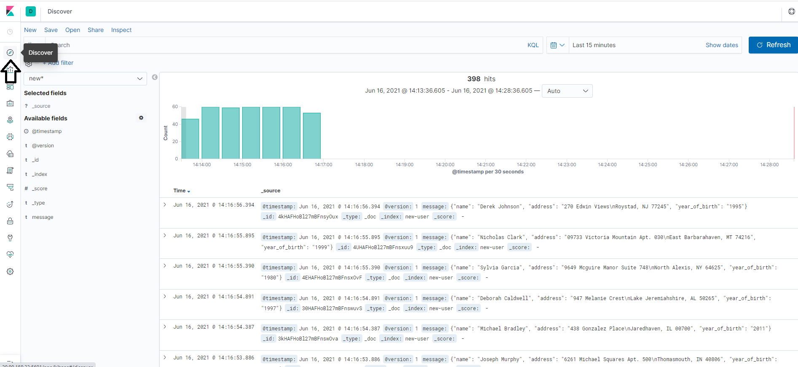

Assignment_Pipe_Producer_Kibana
# Assignment: Sending Data from an address producing application to Elasticsearch

In this exercise we shall create a data pipe where produced data shall be visualized via a web interface. The tools we shall use are:
> 1. Kafka (running in a container)
> 2. Logstash (will running on your native machine)
> 3. Elasticsearch (runnnig in a container)
> 4. Kibana (running in a container)
> 5. Address Producer application (running on your native virtual machine)


#### Architecture of the Pipeline


The producer application, produces fake addresses. It will be configured to do so every 2 seconds and pass the data on to Kafka. A predefined Topic named: `new_users` will receive the data. Logstash, as the subscriber application, is to receive the information as an input and pass it on to Elasticsearch. Logstash will also index the data produced as `new-users` and inject the data into Elasticsearch.  With Kibana we shall be able to visualize all the data that was passed onto Elasticsearch via a web interface. 

Before beginnnig with this exercise make sure you have downloaded the neccessary files by executing the follwoing command: `git clone https://github.com/ioksmio/KES.git` and that kafka, zookeper and the kafka manager are up and running. Check by executing `docker container ls` and you should see the output as follows: 
```
CONTAINER ID   IMAGE                            COMMAND                  CREATED       STATUS       PORTS                                                                     NAMES
b76ebcd04d21   zookeeper                        "/docker-entrypoint.…"   2 hours ago   Up 2 hours   2888/tcp, 3888/tcp, 0.0.0.0:2181->2181/tcp, :::2181->2181/tcp, 8080/tcp   zookeeper
b95a7df2f264   wurstmeister/kafka               "start-kafka.sh"         2 hours ago   Up 2 hours   0.0.0.0:9092->9092/tcp, :::9092->9092/tcp                                 kafka
30470e7ee679   hlebalbau/kafka-manager:stable   "/kafka-manager/bin/…"   2 hours ago   Up 2 hours   0.0.0.0:9000->9000/tcp, :::9000->9000/tcp                                 kakfa-manager
```
If your output is not as depeicted, please instatiate kafka and zookeeper by executing the following command: ` docker-compose -f 03_start-kafka-docker-compose.yml`

### 1. Setting up the Address-Producer application
To perform this assignment we shall have to make sure the producer app, written in python, has access to the appropriate libraries and that it is configured to send data to the respective kafka bootstrap-server.

##### 1.1 Installing Python and the required libraries
> 1. Check whether python is installed on your virtual machine by executing the following command: `python3`. If installed the following will be displayed : 

```
Python 3.8.5 (default, May 27 2021, 13:30:53)
[GCC 9.3.0] on linux
Type "help", "copyright", "credits" or "license" for more information.

````
> Hit `CTRL-D` to get back to the command prompt if the above was displayed. In case Python is installed go to step 4. If however, Python is not installed go to the next step.

> 2. Update the packages list by executing the following command: `sudo apt-get update`
> 3. Install python3 through the following command: `sudo apt-get install python3`
> 4. Install the package manager for python by executing the following command: `sudo apt install python3-pip`
> 5. Install dependencies that will create address data by executing the following command: `pip install Faker`
> 6. Install dependencies that will allow the Faker app to publish data to a defined Topic in Kafka `pip install kafka-python`

##### 1.2 Configure the Producer App to produce data every two seconds and direct it to the respective kafka bootstrap-server and Topic
> 1. Execute the following command: `nano address_producer.py` to edit the file.
> 2. Search for the line containing : `producer  = KafkaProducer(bootstrap_servers=['W.X.Y.Z:9092']` and replace W.X.Y.Z with the IP of your machine (execute: `ifconfig | grep "inet 10"`). Check if anything is missing!
> 3. Search for the line with the following contents:`time.sleep(X)` and replace X with 2

#### 2. Create a Topic within Kafka with 3 partitions
Use your previously attained knowledge to create the appropriate Topic with three partitions to which the producer will write. Can this step be omitted? If so, what could possible consequences be? Make sure the name of the topic is `new_topic` (if you so desire you can also use kafka-manager to create the topic)

#### 3. Start the Producer App
Execute the command `python3 address_producer.py` to have the producer app create random addresses. If your producer app produces more than one entry it will have found the topic `new_user` on the kafka server.

#### 4. Start Elasticsearch and Kibana
Use the the `elasticsearch-kibana.yml` to instantiate Elasticsearch and Kibana
> 1. Parse the file and take note of the respective ports, you may need these later
> 2. Execute the following command: `docker-compose -f elasticsearch-kibana.yml up` to instantiate the respective services. Make sure that you are executing the command in the same folder where the yml file is placed otherwise you will have to specify the path
> 3. Open a browser and enter `http://localhost:5601`  

#### 5. Prepare Logstash
In this step you will install Logstash, configure it as a subscriber and have it ingest indexed data to elastic search
#### 5.1 Install Logstash on your local virtual machine
> 1. Check whether java is installed by executing the following command: `java -version`
> 2. Update the package manager with the following command :`sudo apt-get update`
> 3. If not installed execute the following command: `sudo apt install -y openjdk-11-jre-headless`
> 4. Verify if java is installed properly with `java -version`, you should receive the following output:
```
openjdk version "11.0.11" 2021-04-20
OpenJDK Runtime Environment (build 11.0.11+9-Ubuntu-0ubuntu2.20.04)
OpenJDK 64-Bit Server VM (build 11.0.11+9-Ubuntu-0ubuntu2.20.04, mixed mode, sharing)
```
> 5. Download and install the Public Signing Key by executing the following command: `wget -qO - https://artifacts.elastic.co/GPG-KEY-elasticsearch | sudo apt-key add -`
> 6. You may need to install the `apt-transport-https` package before proceeding. Please execute the following command: `sudo apt-get install apt-transport-https` 
> 7. Save the repository definition to  `/etc/apt/sources.list.d/elastic-7.x.list` by executing the following command: `echo "deb https://artifacts.elastic.co/packages/7.x/apt stable main" | sudo tee -a /etc/apt/sources.list.d/elastic-7.x.list`
> 8. execute `sudo apt-get update` to update your package manager 
> 9. Start the installation of Logstash by executing: `sudo apt-get install logstash`
> 10. Check whether the installation is successful by executing the following command: `sudo systemctl status logstash`. Expect the following output: 
```
logstash.service - logstash
Loaded: loaded (/etc/systemd/system/logstash.service; disabled; vendor preset: enabled)
   Active: inactive (dead)
```
> 11. Start Logstash by executing `sudo systemctl start logstash`
> 12. Check whether Logstash is up and running as a service by executing the following command: `sudo systemctl status logstash`. If so, you should expect the following output:
```

● logstash.service - logstash
     Loaded: loaded (/etc/systemd/system/logstash.service; disabled; vendor preset: enabled)
     Active: active (running) since Thu 2021-06-10 19:06:53 UTC; 5s ago
   Main PID: 4371 (java)
      Tasks: 19 (limit: 19207)
     Memory: 533.2M
     CGroup: /system.slice/logstash.service
             └─4371 /usr/share/logstash/jdk/bin/java -Xms1g -Xmx1g -XX:+UseConcMarkSweepGC -XX:CMSInitiatingOccupancyFraction=75 -XX:+UseCMSInitiatingOccupancyOnly -Djava.awt.headless=tru>
```

#### 5.2 Configure Logstash as a subscriber to Kafka and a data ingestor for Elasticsearch

In this step data will be read from the defined Topic new_user and passed on with an index named new-user. Thus, Logstash has to be configured accordingly. 

> 1. Navigate to the configuration folder for logstash by executing the following command: `cd /etc/logstash/conf.d/`
> 2. Create a new file named pipeline.conf by executing the following command:`sudo touch pipeline.conf`
> 3. Execute the following command: `sudo nano pipeline.conf` to edit the file `pipeline.conf` 
> 4. Enter the following data and edit accordingly
```
input { 
	kafka { 
			bootstrap_servers => "kafka:9092" 
			topics => ["new_user"] 
	} 
} 
output { 
	elasticsearch { 
			hosts => ["localhost:9200"] 
			index => "new-user" workers => 1 
		} 
}
```
> 5. Before you save the file, make sure you have made the correct entries into the configuration file (the proper IP-Addresses and Port for the Kafka-Server (you may use kafka:9092 and localhost:9200 respectively) and the elasticsearch server).
> 6. Restart the logstash service by executing the following command: `sudo systemctl stop logstash` and `sudosystemctl start logstash`
> 7. Create an entry of kafka in the hosts file by executing the following command: `sudo /etc/hosts` and adding the following line: `YourIP-Address    kafka` so that your file looks as follows:
```
127.0.0.1 localhost
10.0.2.5 kafka
# The following lines are desirable for IPv6 capable hosts
::1 ip6-localhost ip6-loopback
fe00::0 ip6-localnet
ff00::0 ip6-mcastprefix
ff02::1 ip6-allnodes
ff02::2 ip6-allrouters
ff02::3 ip6-allhosts
```
> 8. Check whether the kafka server can be found by executing a ping on kafka. The command to be executed is: `ping kafka`. 

#### 5. Make the Data accessible within Kibana 
In this step we would like to verify, whether the data has actually been injected into Elasticsearch

#### 6.1 Create an Index Pattern within Kibana
Kibana will access the Elasticsearch Database and visualize the data stored within. Before we begin working with Kibana we need to create an index pattern. 

> 1. Click on the `Management` icon as shown below. 



> 2. Now click on `Index Patterns` and then on `Create index pattern` 




> 3. Enter `new-*` in the search box named `Index pattern`. If data was transported into Elasticsearch by Logstash then your output should be:
```
 Success! Your index pattern matches 1 index.
```
> 4. Click on the `Next step` button
> 5. To filter your data by time choose `@timestamp` in the drop down menu presented to you
> 6. Click the `Create index pattern` button to finish
> 7. You should be presented with a page that lists all the fields associated with the newly created new* field index


#### 6.2 Verify if your data has been sent to Elasticsearch
> 1. Click on `Discover` as shown below (make sure new* is selected as a filter otherwise you may not see your imported data):



<b></b>
<b></b>

If everything went well you should be seeing your data. The number of Hits you are presented with should be above 0.

